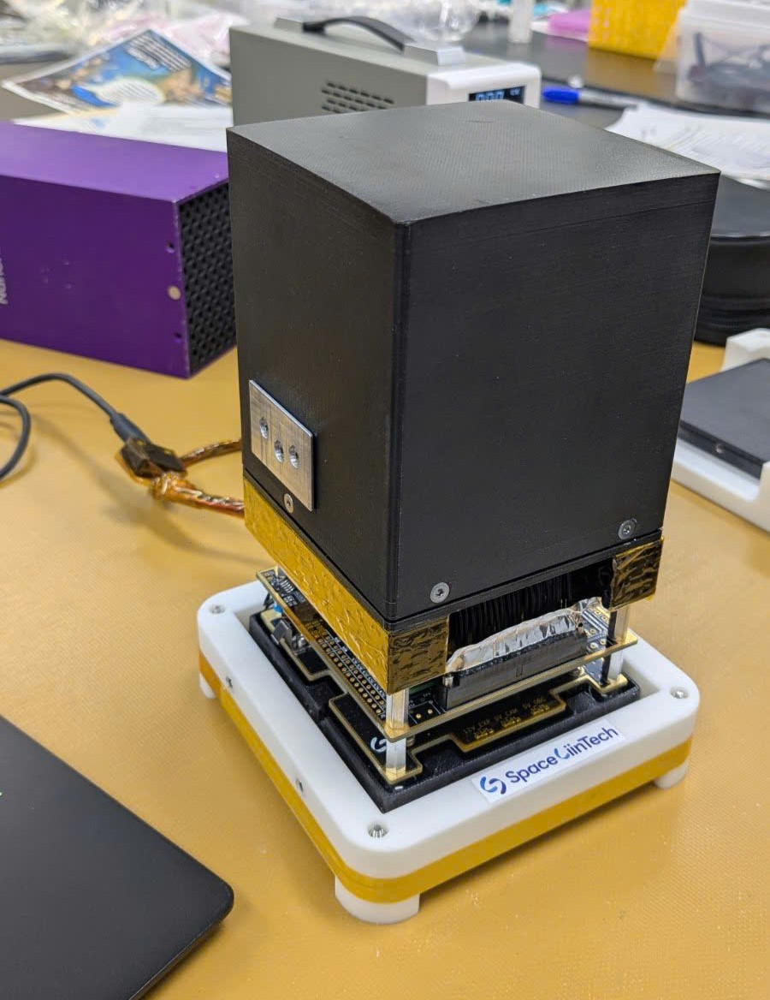

  
  
  

    
    
  

  
  

<h1 align="center">Hello!</h1>

### :hammer_and_wrench: Languages and Tools :

  &nbsp;
  &nbsp;
  &nbsp;
  &nbsp;
  &nbsp;
  &nbsp;
  &nbsp;
  &nbsp;
  &nbsp;
  &nbsp;
  &nbsp;
  &nbsp;
  &nbsp;
  &nbsp;
  &nbsp;
  &nbsp;
  &nbsp;
  &nbsp;

<h1 align="center"></h1>

### :fire: My Stats :

  
  

<h1 align="center"></h1>

### :camera_flash: Project Gallery:

#### 1. Engine Order Telegraph (EOT):
Designed an EOT circuit to transmit commands from the Bridge to the Engine Room using AVR microcontroller
and RS485 communication:

  
  
  
<em>Figure 1, 2: Engine Order Telegraph (EOT)</em>

#### 2. Wireless Repeater Communication System:
Developed a system consisting of one transmitter, multiple intermediate repeaters, and a final receiver to display
system status; used HC12 modules to overcome range limitations:

  
  
<em>Figure 1: Wireless Repeater Communication System</em>

#### 3. JLINK V9:
Redesigned the PCB layout of the original J-Link V9:

  
  
  
<em>Figure 1, 2: JLINK V9</em>

<!-- #### 4. Power Supply System:
Designed and developed a power supply system to ensure operational recovery of a satellite payload after separation from the rocket and landing on the ground:

  
  
  
<em>Figure 1, 2: Power Management Unit (PMU)</em>

  
  
  
<em>Figure 3, 4: Power Distribution Unit (PDU)</em>

  
  
  
<em>Figure 5, 6: I/O Unit (IOU)</em>

  
  
  
<em>Figure 7, 8: Central Onboard Processing Computer (COPC)</em>

  
  
<em>Figure 9: Full system</em>

#### 5. Space Experiment System:
Designed and developed a satellite with the function of measuring experimental samples in space:

  
  
  
<em>Figure 1, 2: Experiment Board (EXP)</em>

  
  
  
<em>Figure 3, 4: Photodiode Board (PDA)</em>

  
  
  
<em>Figure 3, 4: Laserdiode Board (LDA)</em>

  
  
  
<em>Figure 5, 6: Laserdiode External Board (LDE)</em>

  
  
<em>Figure 7: Full system</em>

 -->